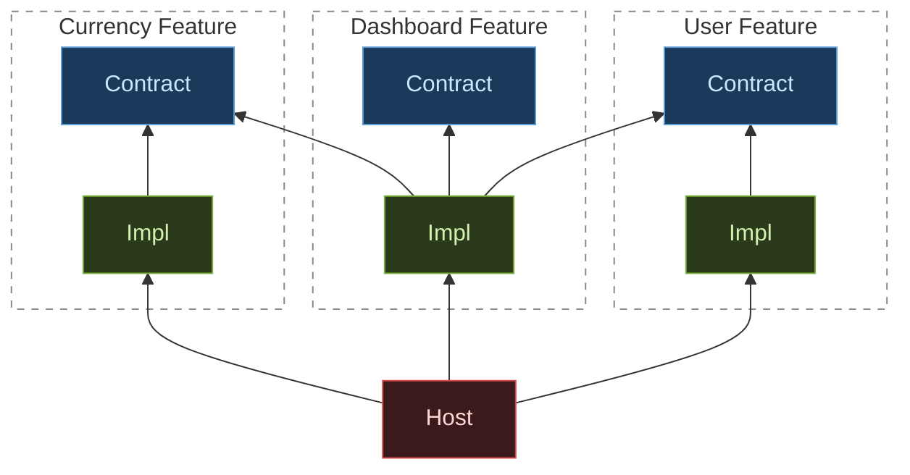

# Modular Architecture Demo

The same architectural pattern — **feature isolation via contract/impl split and an IoC container** — implemented in two ecosystems side by side.

| | React | .NET |
|---|---|---|
| Language | TypeScript | C# 13 |
| Runtime | Browser (Vite + ESM) | ASP.NET Core 10 |
| IoC container | inversify | `Microsoft.Extensions.DependencyInjection` |
| Module unit | npm workspace package | class library project |
| Contract | `*-contract` package | `*.Contracts` project |
| Implementation | `*-impl` package | `*.Impl` project |
| Registration | `bootstrap.ts` → `registerBundle()` | `Program.cs` → `AddXxxFeature()` |

---

## The Problem

As a codebase grows, features start importing each other directly:

```
Dashboard feature
  └── imports UserService     (concrete class)
  └── imports CurrencyService (concrete class)
```

This is convenient at first, but creates tight coupling over time:

- **Testing** Dashboard requires real instances of UserService and CurrencyService — or brittle mocking at the import level.
- **Changing** a service's internals forces updates in every feature that imported it directly.
- **Replacing** an implementation (e.g. swapping a mock for a real API) requires touching all its consumers.
- **Scaling** becomes hard — there is no safe boundary between features, so changes ripple unpredictably.

---

## The Solution

Split every feature into two modules:

```
user-contract   ← interface IUserService + data types. Zero dependencies.
user-impl       ← class UserService implements IUserService. Imports the contract only.
```

Wire them together in one place — the host — using an IoC container:

```
host (bootstrap / Program.cs)
  └── registers: IUserService → UserService
  └── registers: ICurrencyService → CurrencyService
  └── registers: IDashboardService → DashboardService
```

Now the Dashboard feature depends on the *contract*, not the *impl*:

```
Dashboard feature
  └── imports IUserService     (interface — from user-contract)
  └── imports ICurrencyService (interface — from currency-contract)
```

The dashboard module has no reference to `UserService` or `CurrencyService`. You can replace, stub, or lazy-load either without touching Dashboard at all.

---

## Rules

Enforced by the module system (package.json dependencies / .csproj project references) — not by convention or code review. Breaking them is a **build error**.

**Contract modules**
- No dependencies on any other feature — not contracts, not impls
- No logic — only interfaces, data types, and IoC symbols

**Impl modules**
- May depend on their own contract
- May depend on other features' *contracts* (to call their services)
- Must never depend on another feature's *impl*

**Host**
- The only module that imports impl packages
- Wires the IoC container once at startup
- Never uses concrete types after that — everything goes through contracts

---

## The Three Features

Both implementations use the same three features:

- **User** — in-memory store, CRUD operations
- **Currency** — hard-coded rate table, currency conversion
- **Dashboard** — depends on User + Currency *contracts* only; the concrete example of cross-feature injection without impl-to-impl coupling

---

## Dependency Graph



**Legend:** blue — Contract (interfaces, types & symbols) &nbsp;·&nbsp; green — Impl (services, components, hooks) &nbsp;·&nbsp; red — Host (wiring)

---

## Repo Layout

```
react/      React + Vite + inversify
dotnet/     ASP.NET Core 10 + Minimal APIs
```

- [react/README.md](react/README.md)
- [dotnet/README.md](dotnet/README.md)
