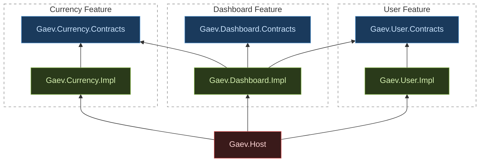

# .NET 10 Modular Architecture Demo

A demonstration of the **Dependency Inversion Principle applied at the assembly level** — the same architectural idea as the React version (npm workspaces + barrel bundles), but expressed through .NET projects and ASP.NET Core's built-in DI container.

> **This is a demo project.** The goal is to illustrate architectural principles with minimal noise. Dependencies are kept to the bare minimum intentionally — no unit tests, no MediatR, no FluentValidation, no AutoMapper, no Serilog/Seq, no OpenTelemetry, no EF Core, no Polly. The built-in ASP.NET Core DI and minimal APIs are sufficient to demonstrate the pattern without introducing libraries whose setup would obscure the architecture itself.

## Overview and Motivation

In a monolithic solution it is tempting to let features reference each other directly. Over time this creates a tangled graph where everything depends on everything. The pattern shown here enforces a hard boundary:

- **Contracts assemblies** export only interfaces and DTOs. They have zero runtime dependencies on other features.
- **Impl assemblies** contain the concrete logic. They may depend on *their own* contracts assembly and on the contracts of other features — never on another feature's impl.
- **Host** is the only place where contracts are wired to implementations. It knows about everything so that nothing else has to.

The result: you can swap, stub, or extract any feature without touching other features' source code.

## Project Types

| Type | Allowed dependencies | Contains |
|---|---|---|
| `*.Contracts` | none | interfaces, records/DTOs |
| `*.Impl` | own Contracts + other Contracts | service classes, `RegistrationExtensions` |
| `Gaev.Host` | all Contracts + all Impl | `Program.cs`, startup wiring |

Rules enforced by project references (not by convention or code review):

- An Impl project *cannot* reference another Impl project — the `.csproj` simply does not have that `<ProjectReference>`.
- Contracts projects have no project references at all.

## Dependency Graph



**Legend:** blue — Contracts (interfaces & DTOs) &nbsp;·&nbsp; green — Impl (service classes) &nbsp;·&nbsp; red — Host (wiring only)

## The `RegistrationExtensions` Convention

Each Impl project exposes a single `RegistrationExtensions` class with two methods — one to register services, one to map endpoints. This mirrors the `register.ts` file in the React version.

```csharp
// Gaev.User.Impl/RegistrationExtensions.cs
public static class RegistrationExtensions
{
    public static IServiceCollection AddUserFeature(this IServiceCollection services)
    {
        services.AddSingleton<IUserService, UserService>();
        return services;
    }

    public static WebApplication UseUserFeature(this WebApplication app)
    {
        app.MapGet("/users", ...);
        app.MapGet("/users/{id:guid}", ...);
        app.MapPost("/users", ...);
        return app;
    }
}
```

Host calls them in two separate chains — one during service registration, one after the app is built:

```csharp
builder.Services
    .AddUserFeature()
    .AddCurrencyFeature()
    .AddDashboardFeature()
    .AddEndpointsApiExplorer()
    .AddSwaggerGen();

var app = builder.Build();
app.UseSwagger();
app.UseSwaggerUI();
app.UseUserFeature();
app.UseCurrencyFeature();
app.UseDashboardFeature();
app.Run();
```

This is the direct .NET equivalent of the React pattern where each bundle calls `container.bind(TOKEN).to(Impl)` inside a `registerBundle()` function. The host just orchestrates — it does not know which concrete class backs each interface.

## Cross-Feature Injection (Dashboard Example)

`DashboardService` lives in `Gaev.Dashboard.Impl`. Its constructor takes `IUserService` and `ICurrencyService` — both from contracts assemblies:

```csharp
internal sealed class DashboardService : IDashboardService
{
    public DashboardService(IUserService users, ICurrencyService currency) { ... }
}
```

At runtime ASP.NET Core's DI container resolves the concrete `UserService` and `CurrencyService` and injects them automatically. `DashboardService` never imports `Gaev.User.Impl` or `Gaev.Currency.Impl`.

## How to Add a New Feature

1. Create contracts project: `dotnet new classlib -n Gaev.MyFeature.Contracts -o features/Gaev.MyFeature.Contracts --framework net10.0`
2. Add interface and DTO files; delete `Class1.cs`.
3. Create impl project: `dotnet new classlib -n Gaev.MyFeature.Impl -o features/Gaev.MyFeature.Impl --framework net10.0`
4. Add `<FrameworkReference Include="Microsoft.AspNetCore.App" />` to the impl `.csproj`.
5. Add reference to own contracts: `dotnet add features/Gaev.MyFeature.Impl reference features/Gaev.MyFeature.Contracts`
6. Add references to any other contracts your impl needs (never another impl).
7. Implement the interface as `internal sealed class` (see note below).
8. Add `RegistrationExtensions.cs` with `AddMyFeature()` and `UseMyFeature()`.
9. Add both projects to the solution: `dotnet sln Gaev.ModularArch.slnx add ...`
10. In `Gaev.Host`: add project references to both, call `.AddMyFeature()` and `.UseMyFeature()`.

> **Why `internal`?** Service classes in impl projects are marked `internal` intentionally — this is a demo choice to make the boundary tangible. `internal` means the concrete type is invisible outside its assembly; the only way to obtain an instance is through the interface via the IoC container. In production you might use `public` to allow direct instantiation in unit tests, or keep `internal` and add `[InternalsVisibleTo("MyFeature.Tests")]`.

## Getting Started

```bash
cd dotnet/Gaev.Host
dotnet run
```

The app starts on `http://localhost:5000` (or the port shown in the console). Open `http://localhost:5000/swagger` for the Swagger UI.

### Available Endpoints

| Method | Path | Description |
|---|---|---|
| GET | `/users` | List all users |
| GET | `/users/{id}` | Get a user by GUID |
| POST | `/users` | Create a user `{"name":"…","email":"…"}` |
| GET | `/currency/convert?amount=100&from=USD&to=EUR` | Convert currency |
| GET | `/dashboard` | Cross-feature summary (user count + sample conversion) |
