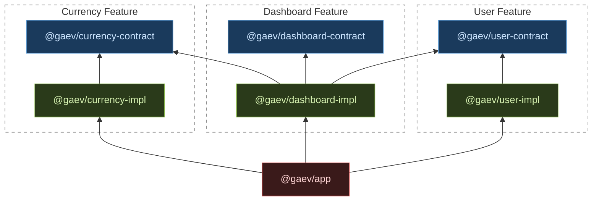

# Modular Architecture Demo — React + npm Workspaces + Vite + inversify

Working demo of modular React architecture driven by the **[Dependency Inversion Principle](https://en.wikipedia.org/wiki/Dependency_inversion_principle)**. Features are isolated npm packages exposing typed contracts only; implementations are lazy-loaded Vite chunks registered with an IoC container at runtime.

[Architecture plan](docs/plans/Modular Architecture Demo.md) · [Implementation issues](docs/ISSUES.md)

> **This is a demo project.** The goal is to illustrate architectural principles with minimal noise. Dependencies are kept to the bare minimum intentionally — no Nx, no Turborepo, no Rush, no Lerna, no monorepo tooling layer of any kind, no unit tests. npm workspaces + Vite are sufficient to demonstrate the pattern without introducing tools whose configuration would obscure the architecture itself.

---

## Overview

In a conventional React codebase the app imports feature code directly. As the codebase grows, this creates tight coupling: changing a service signature forces edits across every consumer, and bundles grow because nothing is ever truly optional. This project demonstrates an alternative where:

- The app **never imports implementation code statically** — only contracts (interfaces + symbols).
- Implementations are **dynamically imported** (separate Vite chunks) and registered into an IoC container on first use.
- Cross-feature dependencies are expressed through **contract symbols**, not concrete module paths.

The result is a codebase where adding, swapping, or removing a feature touches only that feature's own package plus one line in `bootstrap.ts`.

---

## Package Types

### `@gaev/container`
The IoC container. Wraps inversify's `Container` and adds two functions: `registerBundle` (called at startup to declare which symbols a lazy chunk owns) and `resolveAsync` (called at use-time to trigger loading and retrieve a binding).

| Rule | ID |
|---|---|
| No `@gaev/*` feature imports | `ARCH_CTR_1` |
| No React imports | `ARCH_CTR_2` |

Exported API surface: `container`, `registerBundle`, `resolveAsync`, `injectable`, `inject`

### Contract packages (`*-contract`)
Pure TypeScript. Define what a feature _is_ — service interfaces, props interfaces, hook types, and IoC symbols. Nothing else.

| Rule | ID |
|---|---|
| No `@gaev/*` imports | `ARCH_CON_1` |
| No React imports of any kind (including `import type`) | `ARCH_CON_2` |
| No classes | `ARCH_CON_3` |
| No function declarations | `ARCH_CON_4` |

### Implementation packages (`*-impl`)
Concrete code. Import their own contract + `@gaev/container`, implement everything, and call `container.bind(...)` in `register.ts`. The package entry point (`index.ts`) is a single line: `import './register'`. Consumers never reference the impl directly — they resolve it from the container using contract symbols: `resolveAsync<IUserService>(USER_SERVICE)`.

| Rule | ID |
|---|---|
| May statically import any contract package | — |
| No imports from another impl package | `ARCH_IMP_1` |
| `index.ts` must not export anything | `ARCH_IMP_2` |
| `register.ts` must not export anything | `ARCH_IMP_3` |

### `@gaev/app`
The React app. Imports contracts for types and symbols, never impl packages. Uses `React.lazy` + `Suspense` for page-level code splitting; each page component lives in its feature's impl package and is resolved directly from the container via `createLazyPage`.

| Rule | ID |
|---|---|
| No static impl imports (`@gaev/container` and `*-contract` packages are allowed) | `ARCH_APP_1` |
| Dynamic impl imports only in `bootstrap.ts` | `ARCH_APP_2` |

No page files — `App.tsx` resolves pages directly: `createLazyPage(USER_PAGE)`

### Automated enforcement

All rules above are enforced by `eslint.config.js` using only built-in ESLint rules (`no-restricted-imports`, `no-restricted-syntax`) — no plugins. The `ARCH_*` tags on each rule are ESLint constraint IDs; they appear verbatim in editor error messages so violations are easy to trace back to the rule. Run `npm run lint` to check. See [ESLint Architectural Constraint Linter](docs/plans/ESLint%20Architectural%20Constraint%20Linter.md) for the full rule mapping and verification steps.

---

## Dependency Graph



**Legend:** blue — Contract (interfaces, types, symbols) &nbsp;·&nbsp; green — Impl (services, components, hooks) &nbsp;·&nbsp; red — App (wiring)

---

## [Dependency Inversion Principle](https://en.wikipedia.org/wiki/Dependency_inversion_principle)

> High-level modules should not depend on low-level modules. Both should depend on abstractions.

Applied here at the **module-bundle level**:

- `@gaev/app` (high-level) depends on `@gaev/user-contract` (abstraction), not `@gaev/user-impl` (concretion).
- `@gaev/dashboard-impl` depends on `@gaev/user-contract` and `@gaev/currency-contract` — it calls user and currency services through their abstract interfaces, with no knowledge of `UserService` or `CurrencyService`.
- Implementations are loaded at runtime by the container. The app cannot accidentally introduce a compile-time dependency on an impl because the import is behind a function boundary in `bootstrap.ts`.

This means the app bundle contains zero implementation code at parse time. Each impl chunk is fetched only when a page that needs it is first visited.

---

## `@gaev/container`

Two functions drive the whole system:

```ts
// Declare at startup: "symbols X, Y, Z live in this lazy chunk"
registerBundle(USER_SYMBOLS, () => import('@gaev/user-impl'));

// Use at any time: load the chunk if needed, then return the binding
const userService = await resolveAsync<IUserService>(USER_SERVICE);
```

`resolveAsync` finds the bundle entry whose `symbols` array includes the requested symbol. If it hasn't loaded yet it calls the loader, caches the in-flight Promise (so concurrent calls share one fetch), and awaits it. Once loaded, it delegates to `container.get<T>(symbol)`.

inversify bindings use `toDynamicValue` / `toConstantValue` — no decorators, no reflect-metadata emit from user code. `reflect-metadata` is still imported once at the top of `main.tsx` because inversify's `Container` class reads `Reflect` at module load time.

---

## What Contracts Can Expose

| What | Example |
|---|---|
| Data interface | `interface IUser { id: string; name: string; avatarUrl: string; }` |
| Service interface | `interface IUserService { getCurrentUser(): Promise<IUser>; }` |
| Props interface | `interface UserAvatarProps { userId: string; size?: 'sm' \| 'md' \| 'lg'; }` |
| Page props interface | `interface UserPageProps {}` |
| Hook type | `type UseCurrentUser = () => { user: IUser \| null; loading: boolean }` |
| IoC symbol | `const USER_SERVICE = Symbol.for('@gaev/user/USER_SERVICE')` |
| Symbols array | `const USER_SYMBOLS: symbol[] = [USER_SERVICE, USER_AVATAR, USE_CURRENT_USER, USER_PAGE]` |

Contracts must never import React. Props interfaces are plain TypeScript — impl packages that already import React compose `React.ComponentType<Props>` at their own call site:

```ts
// contract — plain props, no React
export interface UserAvatarProps { userId: string; size?: 'sm' | 'md' | 'lg'; }
export const USER_AVATAR = Symbol.for('@gaev/user/USER_AVATAR');

// impl package — React type added here
import type { ComponentType } from 'react';
import { USER_AVATAR, type UserAvatarProps } from '@gaev/user-contract';
const UserAvatar = await resolveAsync<ComponentType<UserAvatarProps>>(USER_AVATAR);
```

---

## Cross-Feature Injection Patterns

### `createLazyPage` in `App.tsx`

Page components live in their feature's impl package, not in the app. `App.tsx` resolves them directly from the container using a small helper:

```ts
const createLazyPage = (symbol: symbol) =>
  React.lazy(async () => ({ default: await resolveAsync<ComponentType>(symbol) }));

const UserPage = createLazyPage(USER_PAGE);
const DashboardPage = createLazyPage(DASHBOARD_PAGE);
```

`React.lazy` accepts any async function returning `{ default: ComponentType }`. `resolveAsync` triggers the bundle load if needed and returns the bound component. The `<Suspense>` fallback is shown while loading; by the time the component renders the impl chunk is fully initialised.

### Top-level `await` in impl modules (`DashboardWidget`)

The same pattern works inside impl packages. Both `DashboardWidget.tsx` and `DashboardPage.tsx` have top-level awaits that trigger cross-feature bundle loads. Because `register.ts` imports both, the entire dashboard-impl bundle is async — its loader Promise (`entry.loading` in the container) won't resolve until all top-level awaits in those modules complete, which means user-impl and currency-impl are fully loaded too. All three impl chunks load in parallel behind a single `<Suspense>` fallback.

```ts
// DashboardWidget.tsx — runs at dashboard-impl bundle init time
const [UserAvatar, userService, currencyService] = await Promise.all([
  resolveAsync<ComponentType<UserAvatarProps>>(USER_AVATAR),
  resolveAsync<IUserService>(USER_SERVICE),
  resolveAsync<ICurrencyService>(CURRENCY_SERVICE),
]);
```

### Hook injection in `DashboardPage`

`DashboardPage` lives in `@gaev/dashboard-impl` and demonstrates cross-feature hook injection: `UseCurrentUser` is a hook type defined in `@gaev/user-contract`, bound by `@gaev/user-impl`, and resolved inside the dashboard impl via top-level `await`. Because the hook is resolved before the component renders, it can be called unconditionally at the top of the component — no Rules of Hooks violation, no conditional wrapper needed.

```tsx
// dashboard-impl/src/DashboardPage.tsx
const useCurrentUser = await resolveAsync<UseCurrentUser>(USE_CURRENT_USER);

export default function DashboardPage() {
  const { user } = useCurrentUser(); // hook from @gaev/user-contract — unconditional ✓
  return (
    <div>
      <p>Logged in as: {user?.name ?? '…'}</p>
      <DashboardWidget />
    </div>
  );
}
```

---

## Bundle Strategy

`app/vite.config.ts` controls how Rollup splits the output. Key settings beyond `manualChunks`:

- **`build.target: 'es2022'`** — required for top-level `await`; Vite's esbuild target is independent of `tsconfig`.
- **`entryFileNames: 'assets/app-[hash].js'`** — renames the entry chunk from the default `index-[hash].js`.
- **`modulePreload.resolveDependencies`** — filters impl chunks out of the `<link rel="modulepreload">` tags Vite injects into `index.html`; without this, Vite eagerly fetches impl chunks on every page load, defeating lazy loading.
- **Impl chunk naming** — a single regex rule `id.match(/\/([\w-]+-impl)\//)` gives every impl package a readable name automatically; new features get named correctly with no config change.

### Chunks produced

| Chunk | Contents | Loaded |
|---|---|---|
| `app` | entry: `main.tsx`, `bootstrap.ts`, `App.tsx` | initial |
| `container` | `@gaev/container` + inversify + reflect-metadata | initial |
| `vendor` | react, react-dom | initial |
| `contracts` | all three `*-contract` packages | initial |
| `user-impl` | `UserPage`, `UserService`, `UserAvatar`, `useCurrentUser` | on `/user` visit |
| `currency-impl` | `CurrencyPage`, `CurrencyService`, `CurrencyInput`, `useConversion` | on `/currency` visit |
| `dashboard-impl` | `DashboardPage`, `DashboardWidget`, `DashboardService` + transitively user-impl + currency-impl | on `/dashboard` visit |

### Why `container` must be a named chunk

`@gaev/container` (and the inversify + reflect-metadata it imports) is used by every impl package's `register.ts`. If `container` has no `manualChunks` rule, Rollup places it in whichever dynamic chunk first claims it in its split algorithm — in practice, `user-impl`. This causes the `app` entry to depend on `user-impl` at parse time to get the `registerBundle` export, loading the entire user feature on every page including routes that never use it. Pinning `container` to its own named chunk guarantees it stays in the initial load group where it belongs.

### DevTools Network walkthrough

Open the Network tab, filter by JS, then navigate:

1. Root `/` — loads `app`, `container`, `vendor`, `contracts` in parallel (all preloaded via `<link rel="modulepreload">`).
2. `/user` — `createLazyPage` fires → `resolveAsync(USER_PAGE)` → loads `user-impl`. `<Suspense>` fallback appears briefly.
3. `/currency` — `resolveAsync(CURRENCY_PAGE)` → loads `currency-impl`.
4. `/dashboard` — `resolveAsync(DASHBOARD_PAGE)` → loads `dashboard-impl` + (if not cached) `user-impl` + `currency-impl` in parallel.
5. Hard-refresh on `/#/dashboard` — `HashRouter` keeps the route client-side; all required chunks load on arrival.

---

## Features

Each feature is a named subfolder under `features/` that contains its contract package, impl package, and README. The subfolder is the ownership and discoverability unit — everything belonging to a feature lives there.

| Feature | Description |
|---|---|
| [User](features/user/README.md) | User identity — current user lookup, avatar display |
| [Currency](features/currency/README.md) | Currency conversion input and service |
| [Dashboard](features/dashboard/README.md) | Cross-feature summary (user + currency) |

---

## How to Add a New Feature

1. **Create `features/my-feature/my-feature-contract/`** — add `package.json` (`name: @gaev/my-feature-contract`, no deps), `tsconfig.json` extending `../../../tsconfig.base.json`, and `src/` with service interfaces, props types (including `MyPageProps` and the page symbol `MY_PAGE`), a hook type, symbols, and `index.ts` re-exporting everything. Add `MY_SYMBOLS: symbol[]` to `symbols.ts`, including `MY_PAGE`.

2. **Create `features/my-feature/my-feature-impl/`** — add `package.json` (deps: `@gaev/container`, `@gaev/my-feature-contract`, `react`), `tsconfig.json` extending `../../../tsconfig.base.json`, and `src/` with concrete implementations. Write `register.ts` that calls `container.bind(...)` for each symbol. Write `index.ts` with a single `import './register'`.

3. **Register the bundle in `app/src/bootstrap.ts`:**
   ```ts
   import { MY_SYMBOLS } from '@gaev/my-feature-contract';
   registerBundle(MY_SYMBOLS, () => import('@gaev/my-feature-impl'));
   ```

4. **Add a page component to the impl** (`features/my-feature-impl/src/MyPage.tsx`) and bind it in `register.ts`:
   ```ts
   container.bind<ComponentType<MyPageProps>>(MY_PAGE).toConstantValue(MyPage);
   ```

5. **Add a route in `App.tsx`:**
   ```tsx
   const MyPage = createLazyPage(MY_PAGE);
   // inside <Routes>:
   <Route path="/my-feature" element={<MyPage />} />
   ```

6. Run `npm install` from `react/` to create the new workspace symlink.

No other packages need to change.

---

## Getting Started

```bash
# from react/
npm install          # install all workspace deps + create @gaev/* symlinks
npm run dev          # start Vite dev server (default: http://localhost:5173)
npm run build        # production build → app/dist/
npm run typecheck    # tsc --build across all packages
npm run lint         # ESLint architectural constraint checks
```

Navigate to `/#/user`, `/#/currency`, or `/#/dashboard`. Each page loads its own impl chunk on first visit. Hard-refresh (`F5`) on any route works correctly via `HashRouter`.
